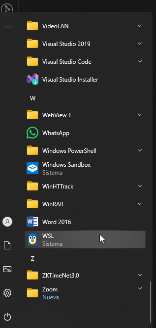
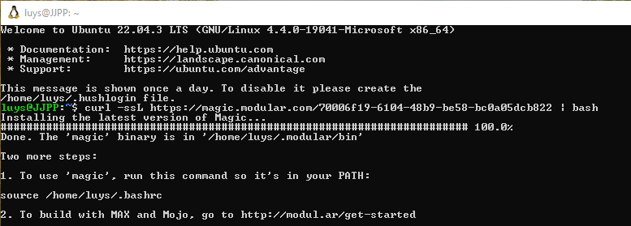
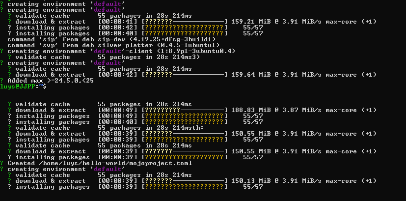

# 🚀 **Fundamentos de Mojo** en Windows con WSL

¡Bienvenidos a mi repositorio! 🎉 Aquí documentaré mis primeros pasos utilizando **Mojo** con la virtualización en **Windows Subsystem for Linux (WSL)**. Si te interesa aprender sobre **Mojo** y cómo comenzar en tu entorno de Windows, ¡este lugar es para ti! 💻

---

## 📚 **¿Qué es Mojo?**
**Mojo** es un lenguaje de programación revolucionario que busca maximizar la eficiencia en el desarrollo de software, combinando alto rendimiento con una sintaxis amigable. 🌟

---

## 🛠️ **Requisitos**
Para comenzar con Mojo en Windows utilizando WSL, asegúrate de tener lo siguiente:

- 💻 **Windows 10 o 11**
- 🐧 **WSL (Windows Subsystem for Linux)** con Ubuntu instalado
- 🌐 **Acceso a Internet** para descargar las herramientas necesarias
- 🛠️ **cURL** para ejecutar comandos de instalación

---

## 🚀 **Instalación Paso a Paso**

1. **Activar WSL** en tu máquina si no lo has hecho aún:
```bash
wsl --install
```




2. Instalar Ubuntu desde la Microsoft Store.

3. Configurar Mojo en WSL ejecutando este comando en la terminal de Ubuntu:

```bash
curl -ssL https://magic.modular.com/70006f19-6104-48b9-be58-bc0a05dcb822 | bash
```


4. Agregar magic a tu PATH ejecutando el siguiente comando:
```bash
source ~/.bashrc
```

5. Verifica la instalación ejecutando:

```bash
    magic --version
```

## Primeros Pasos con Mojo

1. Abre tu terminal en WSL y empieza a experimentar con Mojo:

```bash
magic run example.mojo
```

```bash	
magic init hello-world --format mojoproject
```


2. Explora ejemplos en la documentación oficial 📖.

## 🧑‍💻 Recursos Adicionales

📚 Guía Oficial de Mojo
🛠️ Documentación de WSL

## 💬 Contribuciones

¡Este es solo el comienzo! Si tienes sugerencias o mejoras, no dudes en hacer un pull request o abrir un issue. 🤝


## 🎯 Objetivo del Proyecto

Este repositorio está diseñado para servir como un punto de partida para los desarrolladores que desean usar Mojo en Windows con la virtualización WSL. ¡Vamos a aprender juntos! 🚀
📞 Contacto

## Referencias:

1. https://www.youtube.com/watch?v=knGTSXe7ytI


Si tienes dudas o preguntas, puedes encontrarme en LinkedIn 💼.

¡Gracias por visitar este repositorio! 😊🚀